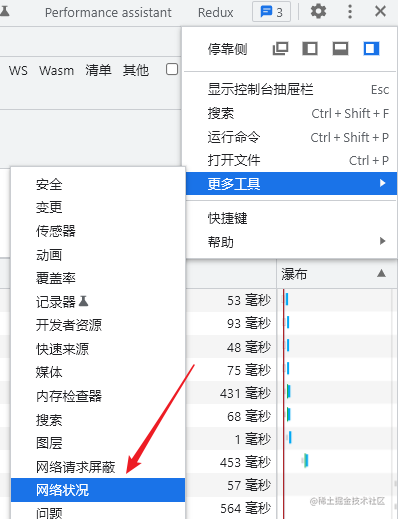
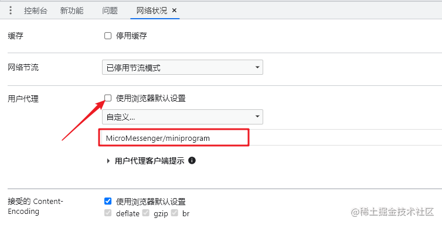

---
nav:
title: 浏览器模拟app或者小程序
order: 1
---

# 浏览器模拟app或者小程序

**1、出发点**

在混合开发的时候可能会有一些场景下会遇到某个h5页面会在app和小程序中同时应用，有时我们的逻辑需要根据app和小程序做不同的处理，那么怎么去在浏览器里模拟这两种不同的环境呢？

**2、常规判断**

如何判断h5所处环境，一般我们都是用 `navigator.userAgent` 这个api去取用户的代理头，然后通过一些正则判断当前环境，例如下面两个常规判断。

    const userAgent = navigator.userAgent;

    /** 微信小程序环境 */
    const isWemp = /MicroMessenger/i.test(userAgent) && /miniprogram/i.test(userAgent);

    /** 苹果系统 */
    cosnt isIos = /(iPhone|iPad|iPod)/.test(userAgent);

**3、问题分析**

知道了判断条件是通过用户代理头的方式去判断，那么可以思考是不是可以去改浏览器的代理头呢？答案当然是可以的，在chrome中我们可以通过下面步骤去修改

- 找到更多工具 -> 网络状况

- 取消勾选使用默认浏览器设置，然后输入自定义用户代理就可以啦（这里我只想模拟下小程序环境，简单改下代理能够走进我的正则判断就可以了）

